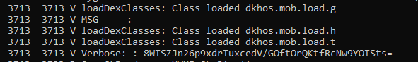
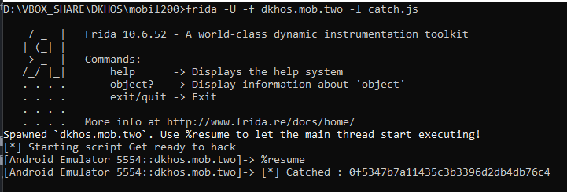
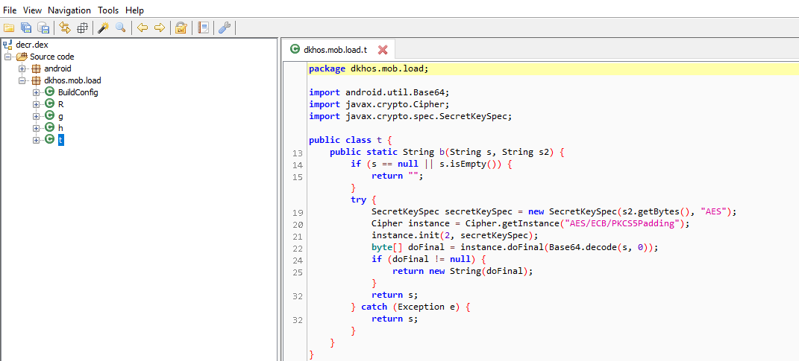
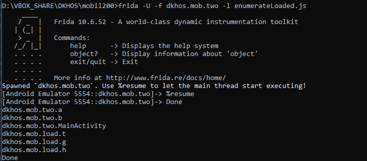
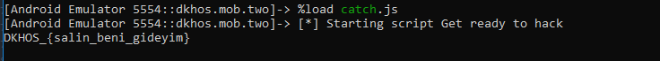

[Şurda](https://github.com/csmali/hackedemedikki-CTF/tree/master/DKHOS/mobile/mobile200) zaten güzel bi writeup var. Sadece frida ile nası çözülebilir onu anlatacağım.




NOT: sadece adb kullanarak loglara bakmak istiyorsanız;
pidof dkhos.mob.two yazıp processin pid'ini alın
adb logcat --pid <pid> ile sadece o processe ait logları görebilirsiniz.

Programın loglarına baktığımızda 3 tane classın load edildiğini görüyoruz. Ama verilen apkyı decompile ettiğimizde içinde yok bu classlar. Program esnasında ```/data/data/dkhos.mob.two/decr``` yoluna kaydedilip daha sonra siliniyor.
Emulator bypassını geçtikten sonra bu decr dosyasının silinmesini engelliyoruz.
[aha böyle ](https://www.invictuseurope.com/blog/43/)


MainActivity içindeki ```a("suport", a.a(b.cZ))``` fonksiyonunun ne çevirdiğini bulmamız gerekiyor.

```
setImmediate(function() {

  console.log("[*] Starting script Get ready to hack");
	Java.perform(function () {
		aaClass = Java.use(	"dkhos.mob.two.a");
		aaClass.a.implementation = function(arg1) {
            retval = this.a(arg1);
            console.log("[*] Catched : " + retval);
			      return retval;
		}
	});
})
```

Yukarıdaki scriptin;
```aaClass.a.implementation = function(arg1)``` satırı ile eğer  ```dkhos.mob.two.a``` classının içindeki a fonksiyonu çağırılırsa fridaya devreye girmesini söylüyoruz.

```retval = this.a(arg1);``` satırı ile fonksiyonu normal çalıştırıp sadece dönen değeri saklamasını belirtiyoruz.

Yakaladığımız değeri ekrana yazdırıp, programın akışını bozmamak için geriye döndürdüğü değeri return ediyoruz.



```0f5347b7a11435c3b3396d2db4db76c4```

Bu değeri ve ilk loglarda çıkan ```8WTSZJn26p9xdrTuxcedV/GOftOrQKtfRcNw9YOTSts=``` değerini unutmuyoruz.

decr dosyasını jdax-gui ile açıyoruz.

```dkhos.mob.load.t``` classındaki b fonksiyonunu kullanmamız gerekiyor.




Dinamik olarak tüm classları şu şekilde bulabiliyoruz;
```

setImmediate(function() {

	Java.perform(function () {
			Java.enumerateLoadedClasses({
				onMatch: function(className) {

					if(className.indexOf("dkhos")>=0){
						console.log(className)
              /*
              Java.choose(className, {
                      onMatch: function (instance) {
                        console.log(instance.b("8WTSZJn26p9xdrTuxcedV/GOftOrQKtfRcNw9YOTSts=","0f5347b7a11435c3b3396d2db4db76c4"))
                      },
                      onComplete: function () { }

                    })

              */
					}

				},
				onComplete: function(){
					console.log("Done");
				}
			});
	});
})

```


Çokta güzel ekrana yazdırıyor. Dikkat ederseniz commente aldım bi kısmı.Şöyle ki frida dex dosyalarını, çağırıldığı uygulamanın base apksında aradığı için sonradan eklenen bu classları bulamıyor.
O yüzden o classın oluşmuş olan instance'ına ulaşamıyoruz.Commentli kısım sonradan eklenen classlar için hata veriyor.

Madem dex dosyasının bulunduğu yeri biliyoruz o zaman kendimiz yükleyelim fridaya

```

setImmediate(function() { //prevent timeout
    console.log("[*] Starting script Get ready to hack");
	//"dkhos.mob.two.a"

	Java.perform(function () {

			Java.openClassFile('/data/data/dkhos.mob.two/decr').load()
			var t = Java.use("dkhos.mob.load.t");
			var tInstance = t.$new();
			console.log(tInstance.b("8WTSZJn26p9xdrTuxcedV/GOftOrQKtfRcNw9YOTSts=","0f5347b7a11435c3b3396d2db4db76c4"));

	});
})
```

decr.dex'i loadluyoruz, artından bu dosyanın içinden ```dkhos.mob.load.t``` classını kullanıcağımızı söylüyoruz. Bu class'ın bir instanceını oluşturuyoruz ki fonksiyonu çağırabilelim.
Ardından bulduğumuz iki değeri b fonksiyonuna yapıştırıyoruz.


