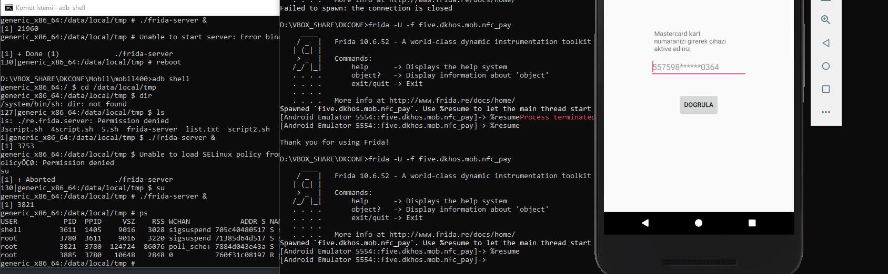

Kullanıcağımız toollar ;

- APK Easy Tool ( http://bit.ly/2EIuDXi )
- IDA PRO 7.0 Freeware ( http://bit.ly/1g6Wbo8 )
- Frida ( ```pip install frida``` )
- jadx ( http://bit.ly/2ClsLyu )

Yüklü olmasını beklediğimiz programlar;

- Android Studio;
  https://developer.android.com/studio/index.html
  + Windows kullanıyorsanız kurduktan sonra PATH inize  ``` C:\Users\[user]\AppData\Local\Android\Sdk\platform-tools ``` eklemeniz gerekiyor.
  + ADB yi ve Emulator'ü  Kullanıcaz.


Soruda bizden 557598******0364 şeklinde bir kredi kartı numarası girmemiz bekleniyor.


6 haneden 1 milyon seçenek var. Luhn algoritması sayesinde bu olasılıkları 100.000'e düşürebiliriz.Ancak bunların hepsini elle girmemiz malesef mümkün değil.


Denemek isteyenler için windows scripti;
+ ```FOR /f %%x IN (luhnchecked.txt) DO ( adb shell input text %%x & adb shell input keyevent 66 66 & adb shell input tap 700 800 & adb shell input keyevent 67 67 67 67 67 67 67 67 67 67 67 67 67 67 67 67 )```

Bu scripti bashscript.bat şeklinde kayıt edip bulunduğu klasorden çağırabilirsiniz

luhnchecked.txt dosyasını oluşturmak için;
python [luhncreater.py](luhncreater.py) > luhnchecked.txt


Bizim bu olasılıkları çok hızlı deneyebilmek için frida kullanmamız gerekiyor. Frida kısaca özetlersek telefonda çalışan bi uygulamaya dinamik olarak bağlanıp, aklınıza gelebilcek nerdeyse herşeyi yapabilyor.
jadx ile gördüğümüz bu classların instancelarına  frida ile ulaşıp, o fonksiyon çağrıldıktan sonra değerleri manipule edebiliyorsunuz.


uygulamayı incelediğimizde anlıyoruzki check() fonksiyonu native bir libraryde ve kontrol ettiği değeri this.m üzerinden alıyor.
a() fonksiyonuda bizim için biçilmiş kaftan. Ne verirsek m'e onu veriyor.
Yolumuz belli;
 - Frida kontrollerini bypass edicez
 - Frida ile classa bağlanıp, önce a fonksiyonuyla m değerini değiştiricez ondan sonrada check fonksiyonunu çağırıp dönen değeri kontrol edeceğiz.

+ apk'yı emulatore yüklemek için ```adb install mobil400.apk```

# Fridayı bağlamak

Fridayı bağlamak için önce emulatorun içine
+  ```frida-server-10.6.52-android-x86_64``` ekliyoruz
+ adb push ../frida-server-10.6.52-android-x86_64 /data/local/tmp/
+ adb shell
+ su
+ cd /data/local/tmp
+ ./frida-server-10.6.52-android-x86_64 &
+ Başka bi terminalde frida-ps -U yazıyoruz ve telefonda çalışan uygulamaları görebiliyoruz.
+ NFC_pay uygulamasını açıyoruz tekrar frida-ps -U yaptığımızda


+ frida -U five.dkhos.mob.nfc_pay ile bağlanmaya çalışıyoruz


+ Bu bi anti-debugger taktiği biraz araştırma sonrasında bunu bypass etmek için -f parametresini eklememiz gerektiğini öğreniyoruz. -f parametresi ile fridaya direk process'e inject olmak yerine Zygote a bağlanıp processi başlat demiş oluyoruz.




Ancak "Frida found yazısı ile karşılaşıyoruz"


İlk bypassımız kolay. jadx ile class yapısını anladıktan sonra APKEasyTool ile apkyı decompile ediyoruz.


 + ``` .\smali\five\dkhos\mob\nfc_pay ```  içinde 2 adet smali dosyası görüyoruz. Bu aşamada jadxdaki görüntü ve smali dosyası arasında mekik dokuyarak, hangi fonksiyon smalide nereye denk geliyor onu anlamamız gerekiyor.


 Anlıyoruzki 48. satırdaki if bizim hedef noktamız. Bu if'e giren değer 1 ise "Frida found" şeklinde uyarı alıyoruz. if'e const olarak 0 verirsek çok tatlı olucak. 39. satır gözümüze çarpıyor ve 48. satırda v0 yerine v4 yazıyoruz. Herşey tamam !

 APKEasyTool ile apkyı sırasıyla Recompile-Zipalign-Sign ediyoruz. Emülatorumuze yüklüyoruz ve işlem tamam. Artık sayı girip Doğrula dediğimizde "Frida found" yazısıyla karşılaşmıyoruz.


 Haydaa. Demekki native libraryde de bi frida checki var.

 native-lib var ancak jadx-gui ile bu dosyaları göremiyoruz. O yüzden APKEasyTool ile decompile ettiğimiz dosyaların içinde olan ./lib/x64_64/libnative-lib.so dosyasına gidiyoruz


 

 libnative-lib.so dosyasını IDA Pro ile açıyoruz.


 Frida checkini takip ettiğimizde loc_6380 fonksiyonua gidiyoruz. loc_6380 test yaptıktan sonra değere göre dallanıyor. Burda  işaretlediğimiz yere bi bypass atmamız lazım.
 Madem frida kullanıcaz o zaman sürekli sol tarafa düşeceğimizden  testteki 1'i 0'a çeviriyoruz.


 Hemen açıyoruz ve ok


 Herşey tamam şimdi fridaya javascript scripti verip check ve a fonsiyonlarını kendimiz çağırıcaz.
 Tüm kredi kartı numarası olasılıklarını dışarda hesaplayıp vermektense, scripte js ile yazılmış luhn algoritmasını ekliyoruz.
```

function valid_credit_card(value) {
  // accept only digits, dashes or spaces
	if (/[^0-9-\s]+/.test(value)) return false;

	// The Luhn Algorithm. It's so pretty.
	var nCheck = 0, nDigit = 0, bEven = false;
	value = value.replace(/\D/g, "");

	for (var n = value.length - 1; n >= 0; n--) {
		var cDigit = value.charAt(n),
			  nDigit = parseInt(cDigit, 10);

		if (bEven) {
			if ((nDigit *= 2) > 9) nDigit -= 9;
		}

		nCheck += nDigit;
		bEven = !bEven;
	}

	return (nCheck % 10) == 0;
}

setImmediate(function() { //prevent timeout
    console.log("[*] Starting script");

    Java.perform(function() {
	     Java.choose("five.dkhos.mob.nfc_pay.MainActivity", {
            onMatch: function (instance) {  //Instance buluyor
				      basenumber = 5575980000000364;
				      for( i = 0;i<1000000;i++)
				      {
				      number = basenumber+i*10000;
				          if(valid_credit_card(String(number))){ // validmi ?
				                instance.a(String(number))	// Change local m string
				                if(i%100 === 0 ) console.log(number)	// 100 seferde bir numarayı ekrana yaz
				                retStr = instance.check() // check fonksiyonunu çağır ve return stringini sakla
				                if(retStr !== "Yanlis numara!" ){
					               console.log("Found number " + number)
					               break 
				                }
				          }
				      }
            },
              onComplete: function () { }

        });
    })

})
```

